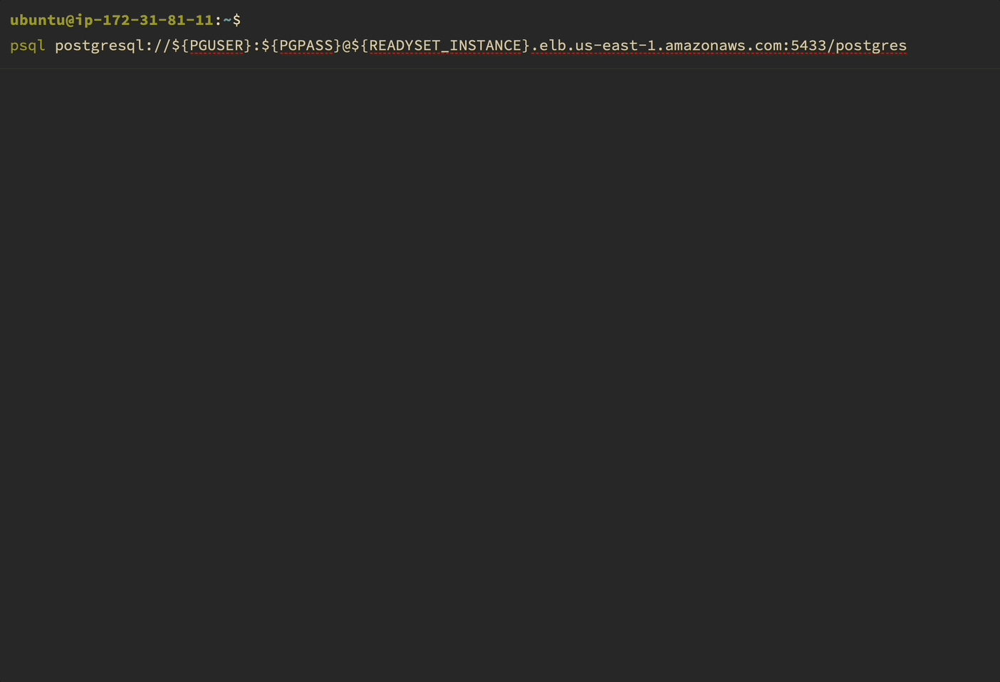
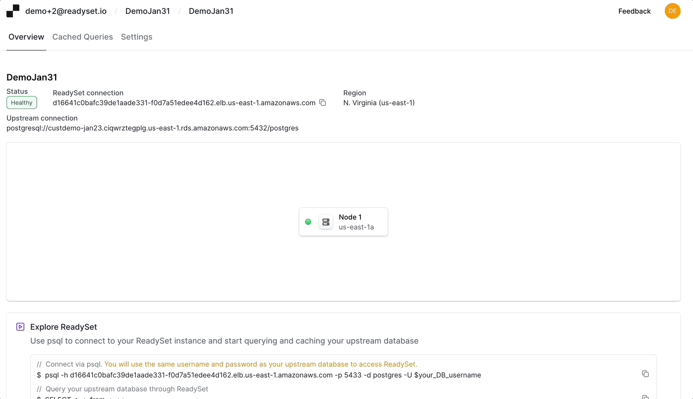
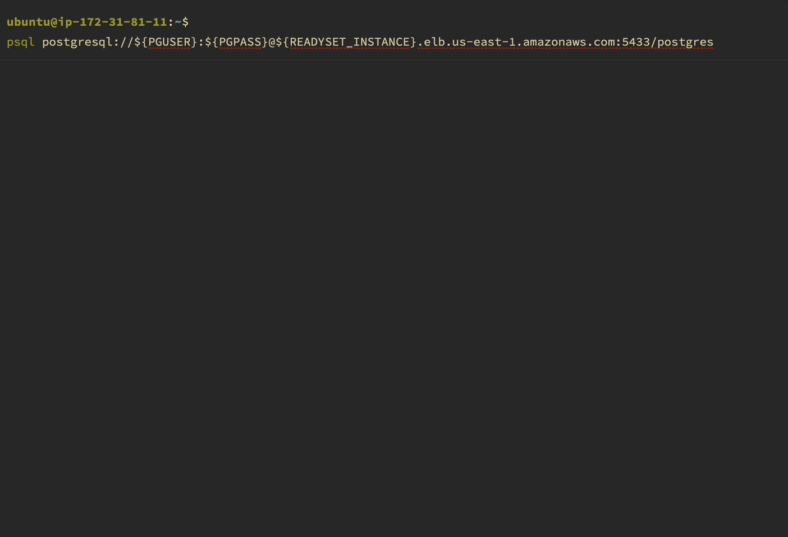

# Cache queries

This section describes how to cache queries on [Readyset.Cloud](https://readyset.cloud)

1. As in the case of the [self-hosted readyset](/get-started/cache), we first send
   query traffic through the Readyset instance. By default all queries sent through
   Readyset are transparently proxied to the backend database.

2. Find the queries you would like to cache and enable them.

3. Re-run the traffic, and experience very low latency query execution.

