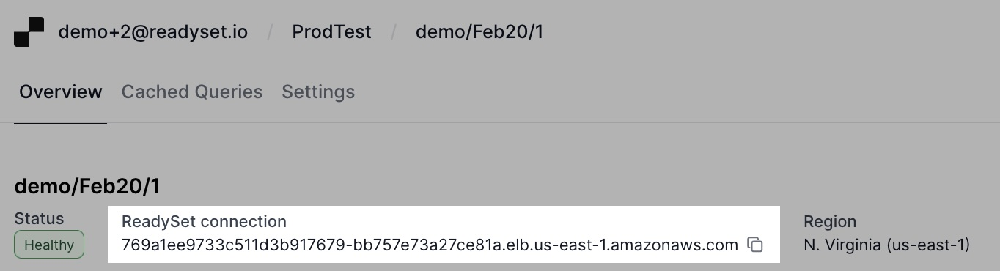

import { Callout } from 'nextra/components'

# Connect to Readyset.Cloud

The URL for the Readyset instance resembles that of a Postgres instance and is
conveniently accessible from the Readyset.Cloud Overview page, as shown in the
screenshot below.

<Callout type="warning"> Care must be taken to ensure that the client connecting
to the Readyset cache instance and the backend database are all located in the
same geo. (e.g.  us-east-1, us-west-1, etc.). Running the clients, cache and
database in the same geo will avoid networking ingress and egress charges. </Callout>

Please follow [these](/get-started/connect) instructions to connect your client
or ORM to Readyset.
