import { Callout } from 'nextra/components'

# VPC Peering

If your application is behind a VPC without public IP access, you will need to configure VPC peering. You need to configure these steps:

1. Accept Readyset Cloud VPC peering request
2. Configure your Route table
3. Configure your Security group.

## Accept Readyset VPC Peering Request

Go to **VPC** > **Peering connections**. You should see one peering connection as **Pending**. Select the pending peering connection and click **Actions** > **Accept request**:

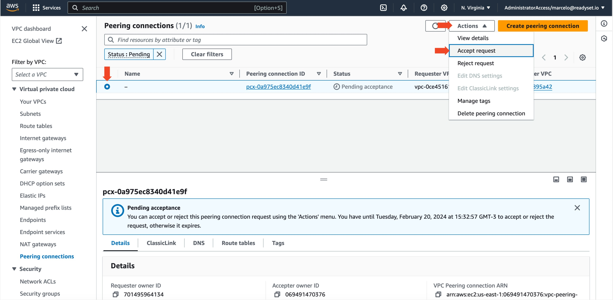

A new pop-up window appears, showing all the details. Take a note of the **Requester CIDRs** and **Peering connection ID** click Accept request:

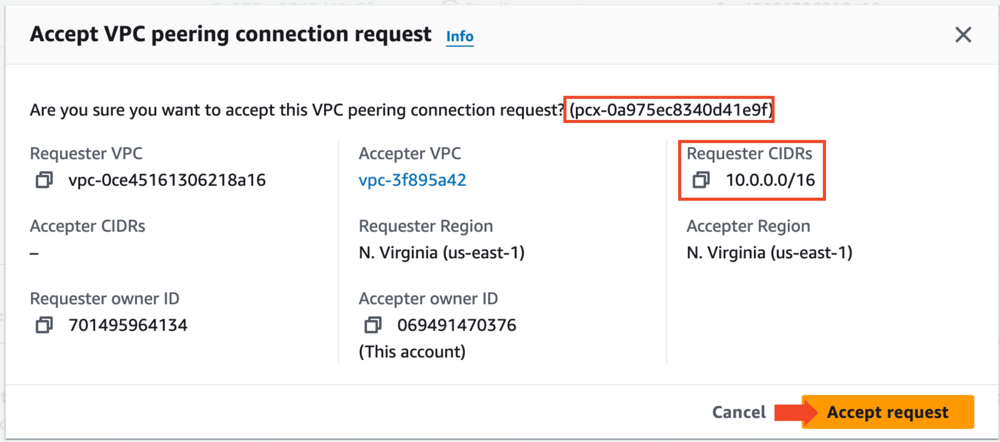

## Configure Route Table

We will need to add the Requester CIDRs block to all routing tables assigned to your VPC. Navigate to the Routing tables ( **VPC** > **Rout tables** ) and filter all routing tables for your VPC:

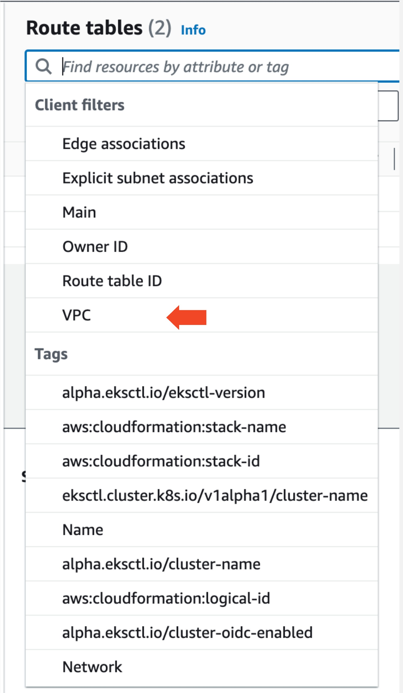

Enter each one of your routing tables by clicking the routing table ID:

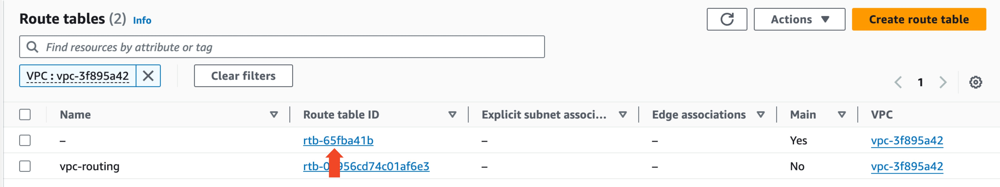

In the Route Table detailed view, select **Edit routes**:

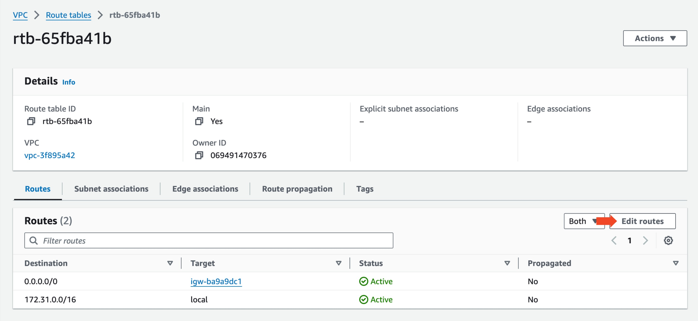

Add the VPC Peering CIDRs block noted before in the **Destination** field, set the target to **Peering Connection**, select the respective **peering connection ID** noted when accepting VPC peering request and click **Save changes**:

Repeat this process for all routing tables on this VPC.

## Configure Security Group

Your security group needs to be configured to allow:
1. Your database to inbound traffic from Readyset CIDR block on your PostgreSQL port (Default 5432):

Go to **RDS** > **Databases** and select the the writer instance of your RDS cluster. In the **Connectivity & Security** tab and click on your security group (You might have more than one security group. Any security group you select is ok):

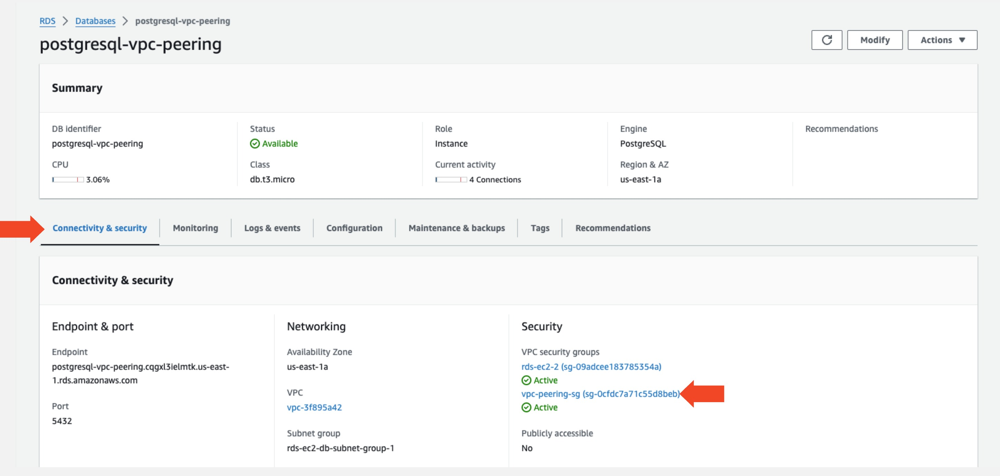

Click in the **Security group ID** to enter your Security Group:

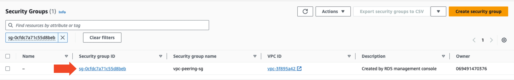

Select **Inbound rules** tab and click **Edit inbound rules**

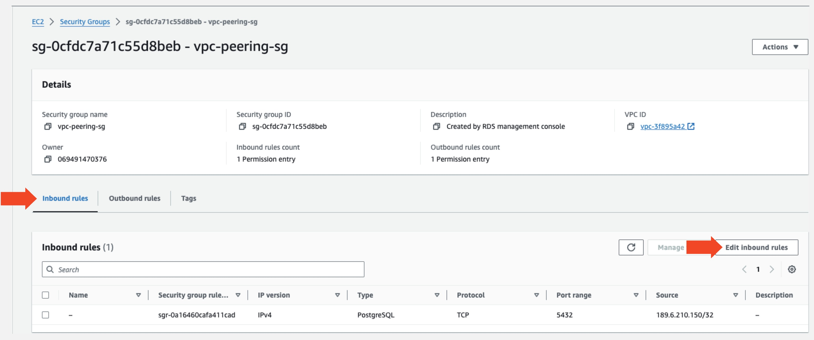

Click **Add rule** button. In **Type** field select **PostgreSQL**, in **Source** field select **Custom**, add the VPC Peering Requester CIDR block and click **Save rules**.

Now Readyset cloud has all the necessary configuration to communicate with your RDS instance.

2. Your application to outbound traffic to Readyset CIDR block on port 5433.

Readyset uses port 5433 for application traffic. In order for your application to connect to Readyset you need to configure your app Security Group.

Navigate to your application instance (eg.: ec2) select **Security** tab and click on your security group (You might have more than one security group. Any security group you select is ok):

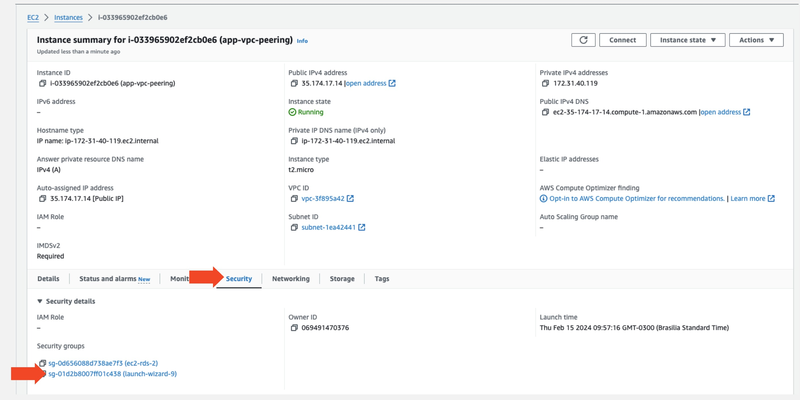

Select **Outbound rules** tab and click **Edit outbound rules**

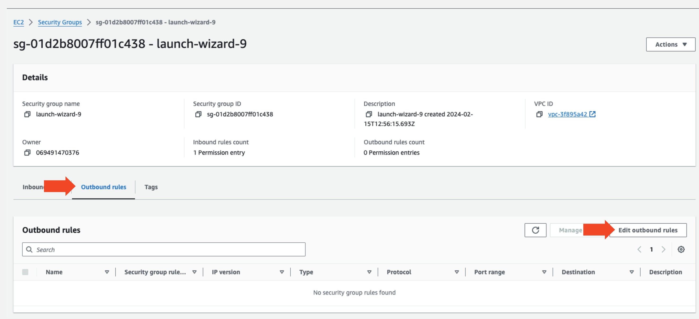

Click **Add rule** button. In **Type** field select **Custom TCP**, in **Port range** type **5433**, in **Source** field select **Custom**, add the VPC Peering Requester CIDR block and click **Save rules**

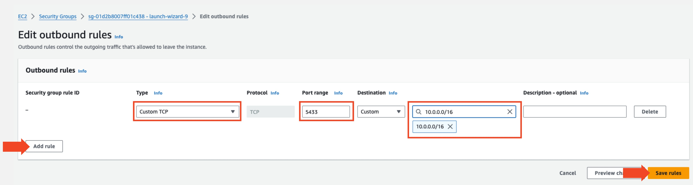

Now your application should be able to connect to Readyset cloud.

<Callout type="info"> Note: Navigate to Readyset Cloud control panel and wait for your cache instance status to appear as **Healthy**. </Callout>

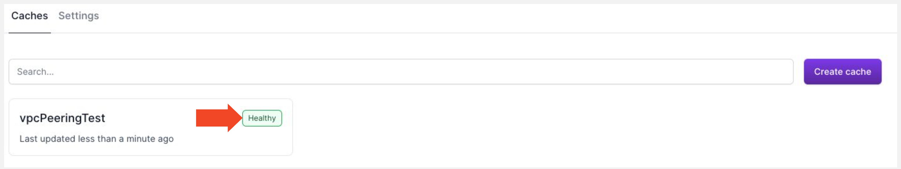
